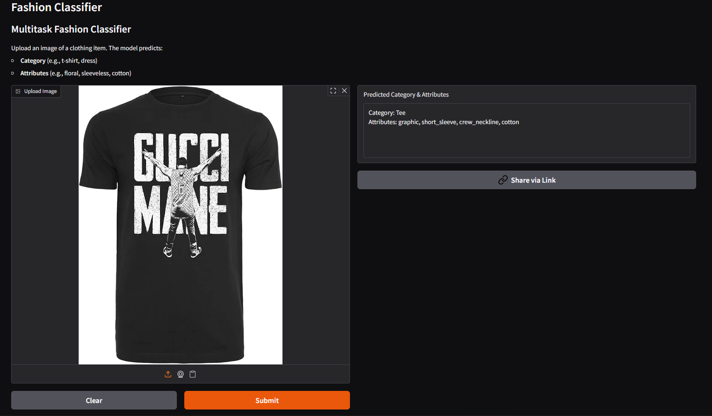

# Fashion Classifier: DeepFashion Category & Attribute Prediction

## Overview

This project is a **computer vision model** designed to predict both **clothing categories** and **visual attributes** from images. 

>*🎓 Educational Project*: Created as the capstone project for the [Applied AI Bootcamp (July 2025) at AllWomen](https://learn.allwomen.tech/ai-bootcamp-request-more-info?utm_term=allwomen&utm_campaign=&utm_source=google&utm_medium=paid&hsa_acc=2544626250&hsa_cam=22674345052&hsa_grp=186612374091&hsa_ad=757970233174&hsa_src=g&hsa_tgt=kwd-315103366955&hsa_kw=allwomen&hsa_mt=p&hsa_net=adwords&hsa_ver=3&gad_source=1&gad_campaignid=22674345052&gbraid=0AAAAAC7KFpXZfLFmgyHL10ovSkoIxJAC1&gclid=CjwKCAjwjffHBhBuEiwAKMb8pMGxvaq3WU4F4GHTMA9yDHfltkYCUZe3T2T4gs4MSPLX0KX6JqmWnBoCvFkQAvD_BwE), this work explores the use of **Transfer Learning** to address real-world **Computer Vision** challenges.

It uses a **filtered subset** of the **DeepFashion dataset**, focusing on **16 categories** and **18 attributes**.

### Categories
Blazer, Blouse, Cardigan, Dress, Hoodie, Jacket, Jeans, Joggers, Jumpsuit, Leggings, Romper, Shorts, Skirt, Sweater, Tee, Top

### Attributes
floral, graphic, striped, embroidered, solid, long_sleeve, short_sleeve, sleeveless, maxi_length, mini_length, crew_neckline, v_neckline, denim, chiffon, cotton, knit, tight, loose

For more information on results and findings, please refer to this <a href="Fashion Classifier_presentation.pdf" target="_blank">presentation</a>.

---

## Live Demo

Click [here](https://huggingface.co/spaces/bruna-cussiol/fashion) to see the app in action.

## Dataset & Preprocessing

The dataset was **balanced using undersampling and oversampling** to reduce bias in the training set.  
Preprocessing involved **iterative cleaning, filtering, and augmentations**, which are not included here, but the **final prepared dataset** is provided for training and evaluation.
The filtered dataset can be found [here](https://drive.google.com/file/d/16yYsyLpMAss0jQp9wFBAPzwALtfNFTlC/view?usp=drive_link).

---

## Model

The model is a **multi-task EfficientNetB0** implemented in TensorFlow/Keras (inspired by PyTorch designs), with:

- **Shared backbone**: EfficientNetB0 pretrained on ImageNet for feature extraction.
- **Category head**: Softmax classifier for 16 clothing categories.
- **Attribute head**: Sigmoid layer for multi-label classification of 18 attributes.
- **Custom metric**: Balanced Accuracy for category classification, alongside standard metrics like accuracy, AUC, precision, and recall.

All model-building functions are defined in `src/utils_model.py`.

---

## Training & Evaluation

- The model is trained on the filtered dataset, optimizing **category and attribute losses simultaneously**.
- Evaluation is performed on a separate test set to measure **generalization performance**.
- Weights from training are saved for inference and further evaluation.

---

## Requirements

- Python 3.8+
- TensorFlow 2.x
- NumPy, Pandas, scikit-learn
- Gradio for demo interfaces